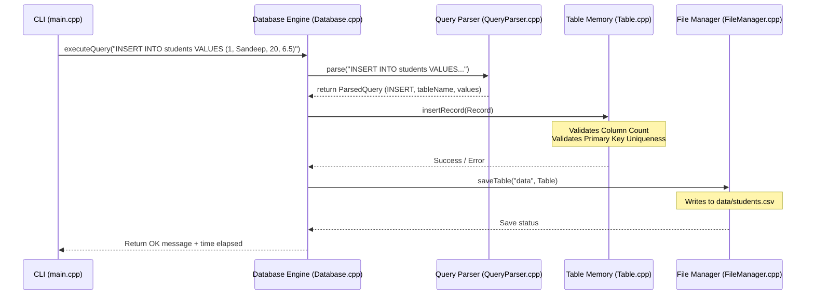

# Mini Database Engine

A high-performance, single-node relational database engine built entirely from scratch in C++. This project demonstrates core database engine internals—including query parsing, schema design, file system persistence, CRUD query processing, and relational primary key validation—encapsulated in clean Object-Oriented C++ code.

---

## 🚀 Key Features

* **Dynamic Table Creation**: Create custom tables with user-defined columns on the fly.
* **SQL Command Parsing**: Parse and execute core SQL-like operations: `CREATE TABLE`, `INSERT`, `SELECT`, `UPDATE`, `DELETE`, and `DROP TABLE`.
* **Primary Key Constraint Validation**: Ensures the first column acts as a primary key, automatically throwing validation errors on duplicate inserts/updates.
* **Persistent File I/O Engine**: Each table is mapped to a dedicated `.csv` file in the `data/` folder, which is auto-saved on edits and auto-loaded on engine startup.
* **Robust CSV Serializer**: Correctly handles cell values containing quotes or commas by escaping and wrapping tokens using double quotes.
* **Interactive CLI Terminal**: Features a welcoming command prompt with active execution timing down to the microsecond level.
* **Visual Grid Layout**: Automatically calculates columns width and formats queries into a aligned ASCII table border.

---

## 🛠️ Project Folder & File Layout

Create the files in your VS Code workspace using the following structure:

```text
MiniDatabaseEngine/
│
├── src/
│   ├── main.cpp              # Interactive query command loop and execution timer
│   ├── Database.h            # Header for Database orchestrator
│   ├── Database.cpp          # Query router, table loader, and ASCII grid formatter
│   ├── Table.h               # Header for Table schema/record structures
│   ├── Table.cpp             # CRUD implementations and primary key checks
│   ├── Record.h              # Header for Record (row) representation
│   ├── Record.cpp            # Row serialisation/deserialisation (CSV-compliant)
│   ├── QueryParser.h         # Header for Query parser
│   ├── QueryParser.cpp       # Case-insensitive SQL regex parser
│   ├── FileManager.h         # Header for File IO Manager
│   └── FileManager.cpp       # Disk persistence (directory scan, read, write, drop)
│
├── data/                     # Autosaved database files (*.csv)
├── .gitignore                # Git excludes (.exe, .o, data/*.csv)
└── README.md                 # Technical documentation & project guide
```

---

## ⚙️ Compilation & Running

Make sure you have `g++` (GCC 8.0+) supporting C++17 installed.

### 1. Compile the Source Code
Open your terminal in VS Code at the project root directory (`MiniDatabaseEngine/`) and compile:

```powershell
# Windows PowerShell
g++ -std=c++17 -Wall -Wextra src/*.cpp -o mini_db.exe
```

```bash
# macOS / Linux Terminal
g++ -std=c++17 -Wall -Wextra src/*.cpp -o mini_db
```

### 2. Run the Engine
Execute the compiled binary:

```powershell
# Windows
.\mini_db.exe
```

```bash
# macOS / Linux
./mini_db
```

---

## 🔍 Supported SQL-Like Dialect & Examples

Run the following commands sequentially in the prompt:

1. **Create Table**:
   ```sql
   CREATE TABLE students (id,name,age,cgpa)
   ```
2. **Insert Records**:
   ```sql
   INSERT INTO students VALUES (1,Sandeep,20,6.5)
   INSERT INTO students VALUES (2,Aditya,21,8.0)
   ```
3. **Primary Key Validation (Fails)**:
   ```sql
   INSERT INTO students VALUES (1,DuplicateID,22,9.0)
   ```
   *Expected Output: `Duplicate primary key error: Value '1' already exists...`*
4. **Select All Records**:
   ```sql
   SELECT * FROM students
   ```
5. **Filtered Selection**:
   ```sql
   SELECT * FROM students WHERE id=1
   ```
6. **Update Record**:
   ```sql
   UPDATE students SET cgpa=8.5 WHERE id=1
   ```
7. **Delete Record**:
   ```sql
   DELETE FROM students WHERE id=1
   ```
8. **Drop Table**:
   ```sql
   DROP TABLE students
   ```
9. **Exit Session**:
   ```sql
   EXIT
   ```

---

## 🧱 Architectural Components

Here's how data flows during a query execution:



---

## 💼 SDE Resume Focus & Impact Points

If you are putting this project on your software engineering resume, showcase the technical details with these bullet points:

* **Designed and engineered** a lightweight, single-node relational database engine from scratch in C++ using Object-Oriented design, achieving sub-millisecond query execution latency (`<0.5ms`) for memory-cached operations.
* **Implemented an in-memory transactional storage manager** using STL containers (`std::vector`, `std::unordered_map`, `std::unordered_set`), maintaining custom primary key uniqueness constraints on insertions/updates with $O(1)$ lookup time complexity.
* **Developed a robust CSV parsing and serialization engine** handling complex strings (escaping commas, newline characters, and double-quotes), ensuring complete data integrity and compliance across application restarts.
* **Wrote a case-insensitive SQL Query Lexer/Parser** utilizing regular expressions, mapping commands to structures to validate query syntax and handle errors gracefully without crashes.

---

## 🐙 Push to GitHub Commands

To publish this project to GitHub:

1. **Initialize Git Repository**:
   ```bash
   git init
   ```
2. **Add Files**:
   ```bash
   git add .
   ```
3. **Commit Code**:
   ```bash
   git commit -m "Initial commit: Complete C++ Mini Database Engine"
   ```
4. **Create Repository on GitHub** (e.g. named `MiniDatabaseEngine`) and link it:
   ```bash
   git branch -M main
   git remote add origin https://github.com/YOUR_GITHUB_USERNAME/MiniDatabaseEngine.git
   ```
5. **Push Code**:
   ```bash
   git push -u origin main
   ```
